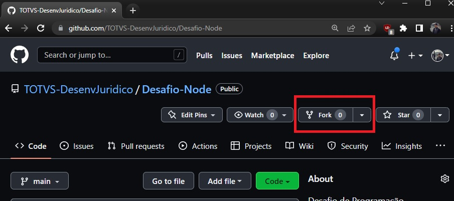

# Desafio de programação - Node/Typescript

Para copiar o projeto realize o processo de `fork` que está detalhado mais abaixo


## Como realizar o Fork
---
Na página deste projeto, no canto superior direito é possivel ver 



Ao clicar na caixa será apresentada a página para criar a cópia do repositório para o seu perfil


Ao confirmar a criação o Github irá criar o repositório. É possivel identificar o repositório original, pois logo abaixo do nome aparecerá qual o projeto original conforme imagem abaixo 


Este será o repositório que irá subir os ajustes do projeto e a url deste repositório deve ser enviado para que possamos avaliar o que foi feito.

## Após o Fork

---

Após realizar o `fork`, clone o projeto do seu repositório para a sua maquina. Para fazer a cópia do projeto instale o [Git](https://git-scm.com/downloads) e rode o comando abaixo

```git
git clone https://github.com/<...>
```

A URL do repositório pode ser encontrado no botão `code` em verde conforme imagem abaixo:


## Como rodar o projeto

---

Para rodar este projeto é necessário que a maquina tenha o [Node](https://nodejs.org/en/) instalado. **Para evitar problemas, sugerimos que instale a versão LTS**

Para realizar a instalação das dependências utilize o comando `npm install` e para rodar o projeto em sua maquina utilize o comando `npm run dev:server`


## Entrega

---

A entrega desde projeto será o próprio projeto.

Neste projeto temos uma base de código utilizando Node com Typescript. Este projeto tambem contem dois arquivos `.md`, sendo que o `Questoes.md` contem as solicitações voltadas para Programação e o `Questoes_SQL.md` contem as questões de SQL. 

Os ajustes solicitados no `Questoes.md` devem ser feitos no arquivo `server.ts` enquanto os exercicios do `Questoes_SQL.md` tem seu próprio espaço para serem respondidas.

Pedimos que deixe as questões em cada arquivo em ordem. O exercicio 4 do `Questoes.md` é opcional mas é **interessante que seja respondido** pois nos ajudará a entender seu processo de desenvolvimento.

No arquivo `Questoes_SQL.md` atente-se aos exercicios 5 e 6, pois alem da Consulta a ser montada temos perguntas que devem ser respondidas.


# Considerações Finais
Somente serão considerados os commits realizados até o envio do e-mail. Os commits que forem realizados após o horário de envio não serão considerados na avaliação.

Após realizar o ultimo `commit` não esqueça de fazer o `Push` para o repositório, pois se não realizar o `Push` não teremos o que avaliar.

